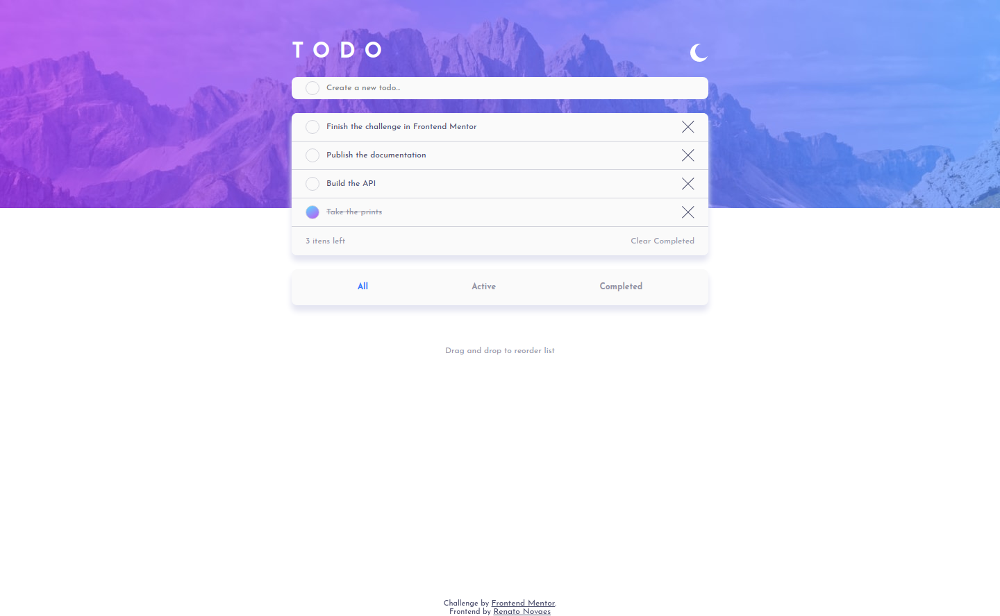
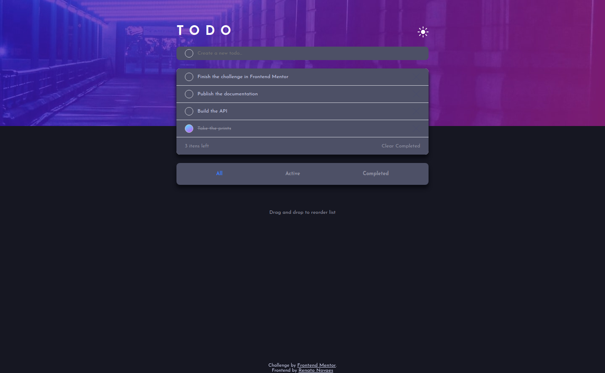
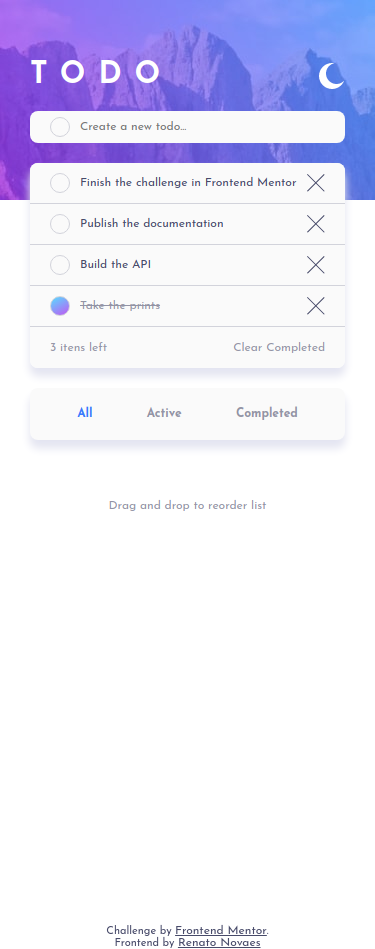
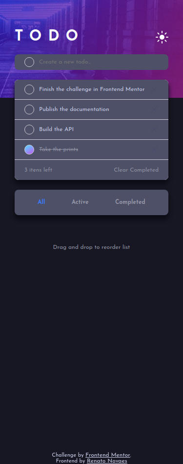

# Frontend Mentor - Todo app solution

This is a solution to the [Todo app challenge on Frontend Mentor](https://www.frontendmentor.io/challenges/todo-app-Su1_KokOW). Frontend Mentor challenges help you improve your coding skills by building realistic projects. 
  
Also this is also a part of my first project in GitHub. I build the frontend using this interface provided by the Frontend Mentor and the Backend in another repository, with my first API in Node.  

[You can check the backend in this link](https://github.com/renatoalmeida49/todo-api)

## Table of contents

- [Overview](#overview)
  - [The challenge](#the-challenge)
  - [Screenshot](#screenshot)
  - [Links](#links)
- [My process](#my-process)
  - [Built with](#built-with)
  - [What I learned](#what-i-learned)
  - [Continued development](#continued-development)
  - [Useful resources](#useful-resources)
- [Author](#author)
- [Acknowledgments](#acknowledgments)

## Overview

### The challenge

Users should be able to:

- View the optimal layout for the app depending on their device's screen size
- See hover states for all interactive elements on the page
- Add new todos to the list
- Mark todos as complete
- Delete todos from the list
- Filter by all/active/complete todos
- Clear all completed todos
- Toggle light and dark mode
- **Bonus**: Drag and drop to reorder items on the list

### Screenshot

### Links

- Live Site URL: [Netlify](https://blissful-colden-6de82d.netlify.app/)

## My process

### Built with

- Semantic HTML5 markup
- CSS custom properties
- Flexbox
- Mobile-first workflow
- Sortable

### What I learned

I work with Vue in all my projects. But for this one I decided to build only with JS. And I could see the challenges of the use this technology without a framework.  
  
The dark mode was something completely new for me and I will study harder to optimize this feature.

At some point in the project I started to use git flow. Frow now on I will only use git flow for this and future projects.

Also I decided to go one step further and start my studies with Node JS to build the backend of this application.

### Continued development

In my script.js I repeat myself in some points. I must apply the concept of DRY.

### Useful resources

- [Sortable](https://cdnjs.com/libraries/Sortable) - I must confess: in the end of the project I was tired, so I decided to use a library to the 'drag and drop' bonus challlenge.
- [Array Methods](https://www.freecodecamp.org/news/the-javascript-array-handbook/) - There are a lot of methods and ways to work with arrays and here is a very good link with a very good resume about some of them.

## Author

- Website - [Renato](https://www.renatonovaes.dev)
- Linkedin - [@yourusername](https://www.linkedin.com.br/in/renatonovaes49)

## Acknowledgments

My friend Rafael Rodrigues always with good insights about the project and design and Matheus Henryk with valious tips about the UX.
